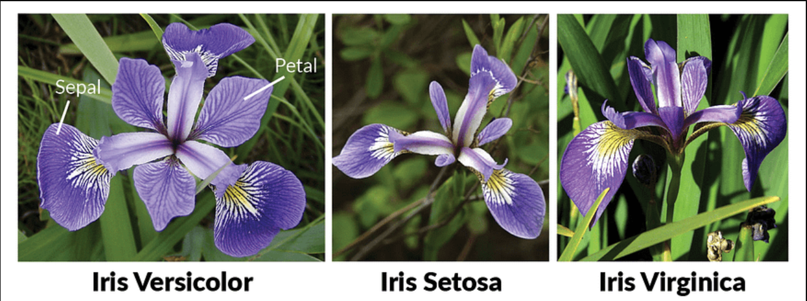
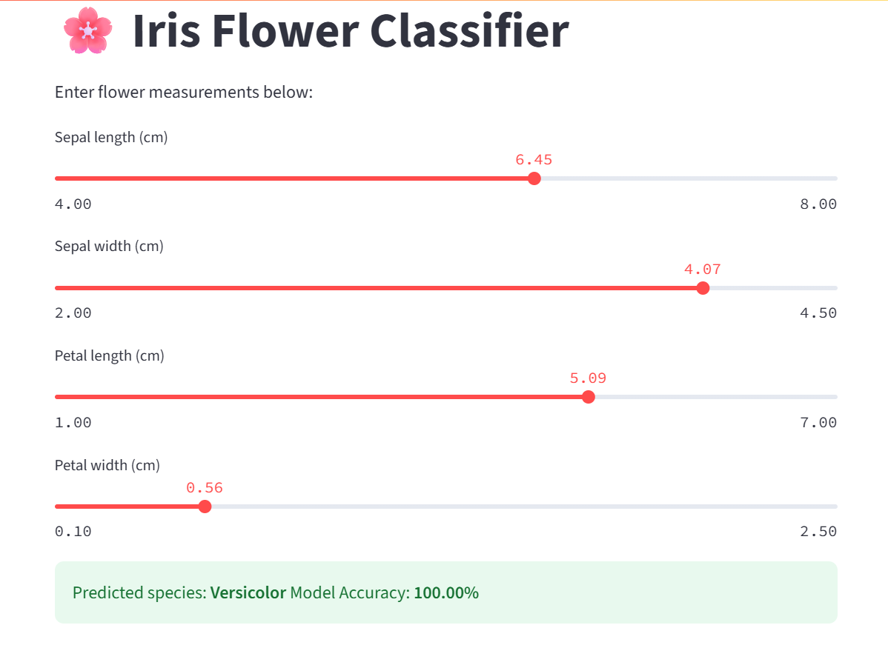

# 🌸 Iris Flower Classifier

# 📸 Screenshots


A beginner-friendly machine learning app that classifies Iris flowers into **Setosa**, **Versicolor**, or **Virginica** using the famous Iris dataset. Built with `scikit-learn` and deployed using `Streamlit`.

---

## 🚀 Features

- 📊 Trained on the classic Iris dataset
- 🔍 Predicts flower species from 4 input features:
  - Sepal length
  - Sepal width
  - Petal length
  - Petal width
- ⚙️ Uses Logistic Regression (can be extended to KNN, SVM, etc.)
- 🌐 Deployed as an interactive Streamlit web app

---

## 🌐 Live Demo

👉 [Click to Open App](https://iris-flower-classifier-bishow03.streamlit.app/)

---

## 📁 Project Structure
- iris-flower-classifier/
- ├── app.py              # Streamlit app interface
- ├── iris_model.py       # Trains the ML model and exports it
- ├── iris_model.pkl      # Saved trained model
- ├── requirements.txt    # List of dependencies
- └── README.md           # Project overview (you’re reading it!)

---

## 💻 Run Locally

### 1. Clone this repo

```bash
git clone https://github.com/BISHOW03/iris-flower-classifier.git
cd iris-flower-classifier
```
# 2. Install dependencies
```bash
pip install -r requirements.txt
```

# 3. (Optional) Retrain the model
```bash
python iris_model.py
```
# 4. Run the app 
```bash
streamlit run app.py
```

## 🧠 Built With
- Python
- scikit-learn
- pandas
- numpy
- Streamlit
- joblib

# 📸 Screenshots


# 🌟 Support
If you found this helpful:
- ⭐ Star this repo: [BISHOW03/iris-flower-classifier](https://github.com/BISHOW03/iris-flower-classifier)
- 🍴 Fork it and create your own version
- 🧠 Share with friends learning ML

---

## 👤 Author
**Bishow Ghimire**  
📧 [bishowghi2061@gmail.com](mailto:bishowghi2061@gmail.com)  
🌐 [github.com/BISHOW03](https://github.com/BISHOW03)

If you'd like to connect or collaborate, feel free to reach out!


